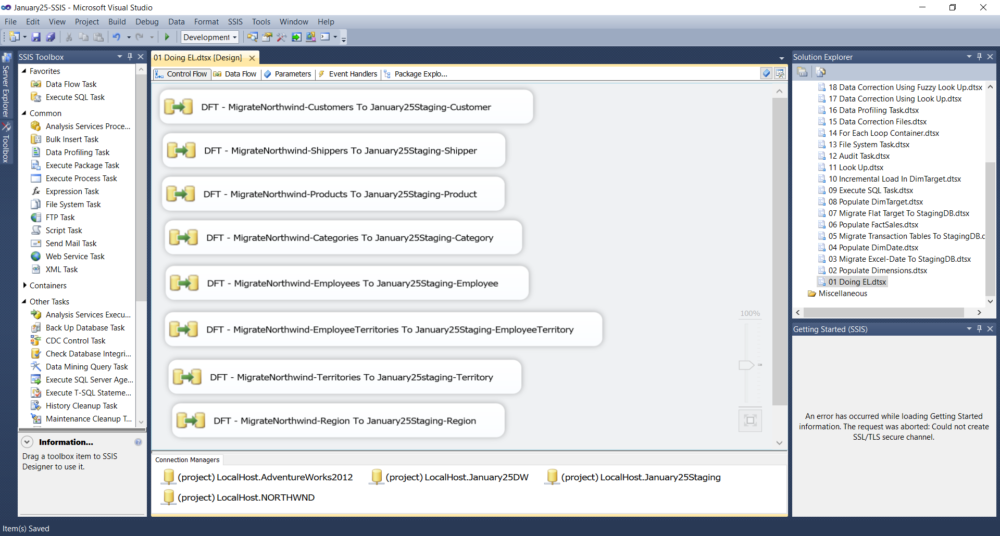
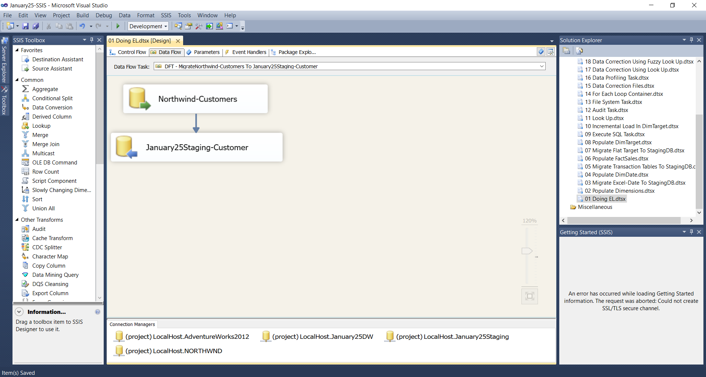
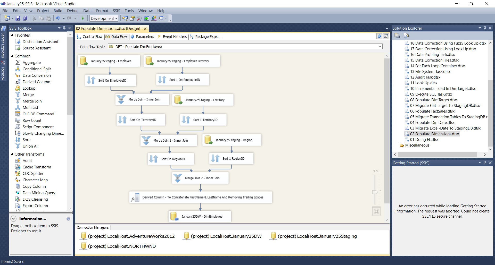
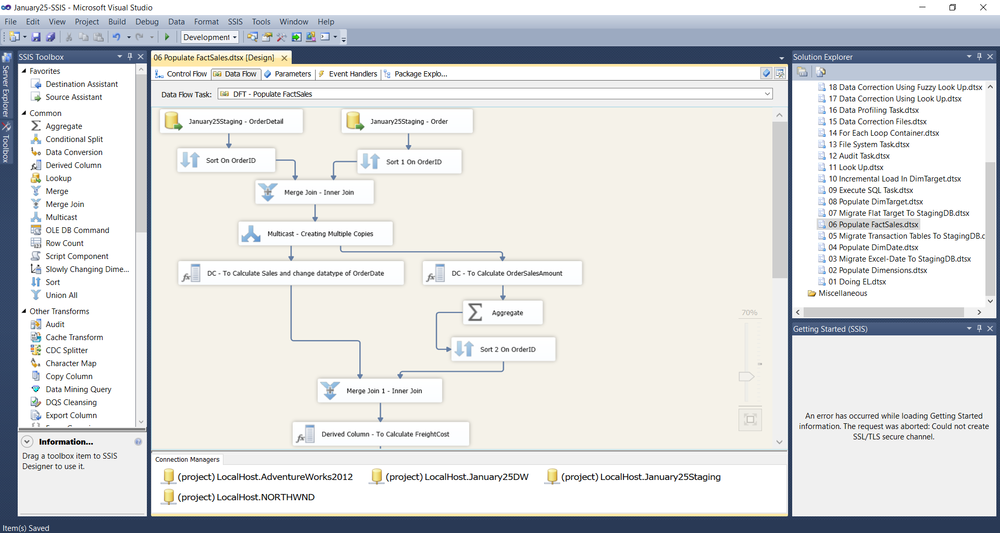
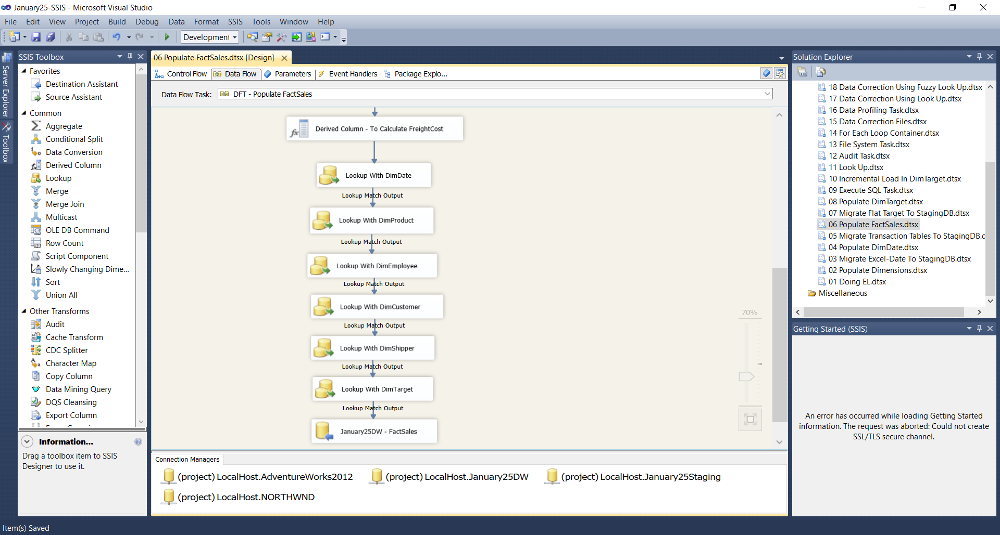
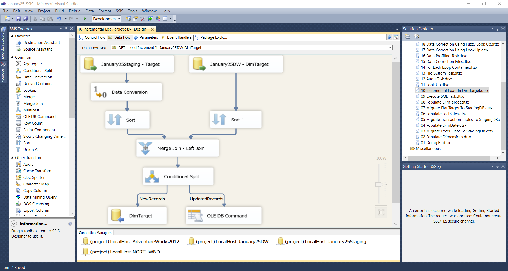
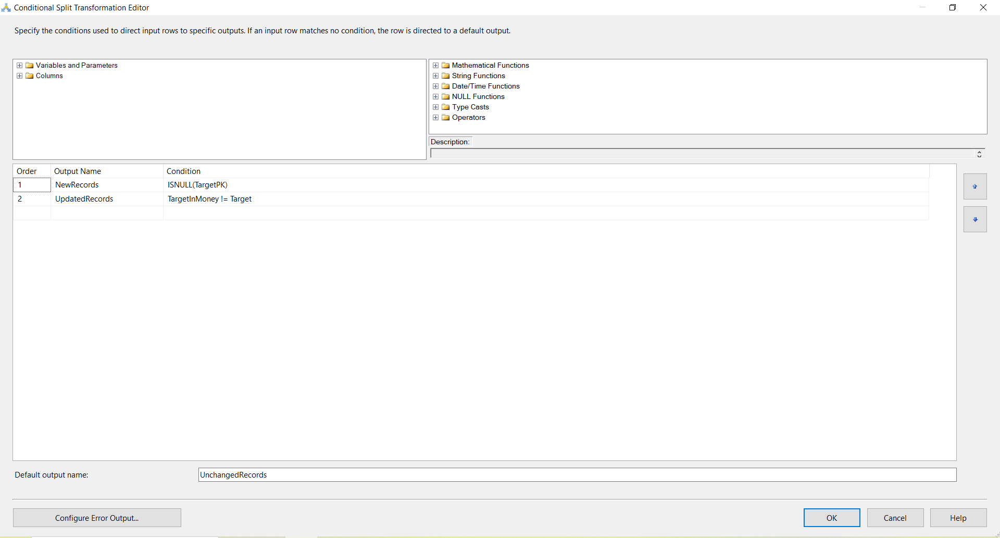

# Data Warehouse & ETL Implementation using SSIS

## Project Overview
This project demonstrates an end-to-end ETL implementation using SQL Server Integration Services (SSIS) to load data from source systems into a structured data warehouse.  
The solution follows industry-standard ETL practices including staging layers, incremental loading logic, and dimensional modeling.

The project is designed to reflect real-world data warehousing workflows commonly used in Business Intelligence (BI) and analytics environments.

---

## Architecture Overview
**Source Systems → Staging Database → Data Warehouse**

- Source data extracted from the Northwind relational database and flat files  
- Intermediate staging layer used for data cleansing, validation, and transformation  
- Final data loaded into dimension and fact tables in the data warehouse  

---

## Tools & Technologies
- SQL Server  
- SQL Server Integration Services (SSIS)  
- SQL Server Management Studio (SSMS)  
- ETL & Data Warehousing Concepts  

---

## Key Concepts Implemented
- Staging layer design for controlled data processing  
- Dimension and fact table loading  
- Incremental load logic using Conditional Split  
- Lookup transformations for surrogate key mapping  
- Data validation and transformation logic  
- Source-to-target mapping documentation  

> **Note:** Tables were created directly in SSMS, and incremental load logic was implemented using Conditional Split transformations.

---

## ETL Workflow Documentation

### 1️⃣ Control Flow Overview

**Insight:**
- Orchestrates multiple Data Flow Tasks for staging, dimension, and fact table loads.
- Ensures structured and sequential execution of the ETL pipeline.

---

### 2️⃣ Staging Data Load

**Insight:**
- Extracts data from source systems and loads it into the staging database.
- Provides an isolated layer for cleansing and transformation before warehouse loading.

---

### 3️⃣ Dimension Table Load

**Insight:**
- Loads dimension tables using lookup-based logic.
- Handles new and existing records through incremental load design.

---

### 4️⃣ Fact Table Load

**Insight:**
- Populates fact tables by integrating data from staging and dimension tables.
- Applies business logic and maintains referential integrity using lookup transformations.

---

### 5️⃣ Incremental Load Logic (Conditional Split)

**Insight:**
- Implements incremental loading by separating new and existing records.
- Ensures efficient data refresh without performing full reloads.

---

## Data Model & Mapping
Source-to-target mappings and data model documentation are provided to ensure traceability, transparency, and clarity of all transformations applied during the ETL process.

📂 **Location:**  
mapping-documents/Data Model and Mapping Document.xlsx

---

## Conclusion
This project demonstrates practical ETL development skills including pipeline orchestration, incremental data loading, and dimensional modeling using SSIS.  
It reflects hands-on experience aligned with real-world BI and data warehousing scenarios and complements analytical reporting built using SQL and Power BI.
